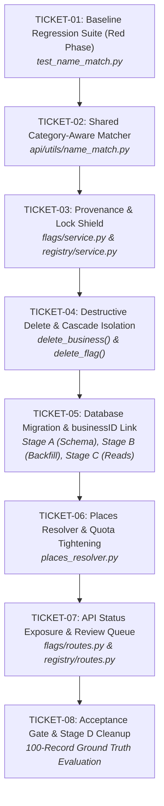

# REVELA Pin Snapping & Matcher Safety Fix
## Concrete Engineering Ticket Breakdown & Backend Implementation Specification

**Based on:** `REVELA Pin Snapping: Revised Plan.pdf` (October 8, 2026)  
**Target Codebase:** `c:\REVELA-prod\revela_backend`  
**Target Database:** MySQL 9.7 (`railway`)  

---

## 1. High-Level Dependency Graph & Phase Sequencing



---

## 2. Per-File Change List & Exact Function Mappings

| Target File | Function / Symbol | Line Range in Active Code | Nature of Modification |
| :--- | :--- | :--- | :--- |
| **`api/utils/name_match.py`** *(NEW)* | `parse_name()`, `_overlap()`, `name_match()` | *New File* | Implement category-aware normalization, token overlap, category conflict caps, and one-to-one candidate scoring. |
| **`tests/test_name_match.py`** *(NEW)* | Test cases suite | *New File* | Regression unit tests locking in failure cases (Silva Pharmacy vs Apartment, Jose Store vs Jose Bakery, etc.). |
| **`api/flags/service.py`** | `_normalize_business_name` | [L305–L328](file:///c:/REVELA-prod/revela_backend/api/flags/service.py#L305-L328) | **Deprecate / Delegate** to `name_match.parse_name`. Remove noisy substring stripping that leaves stray `'s'` tokens. |
| **`api/flags/service.py`** | `_name_similarity` | [L330–L377](file:///c:/REVELA-prod/revela_backend/api/flags/service.py#L330-L377) | **Replace** with `name_match`. Eliminate `if n1 in n2 or n2 in n1: return 0.95` false-positive shortcut. |
| **`api/flags/service.py`** | `_match_poi_to_registry` | [L379–L440](file:///c:/REVELA-prod/revela_backend/api/flags/service.py#L379-L440) | **Replace 4-branch heuristic** with Section 4 Tiered Matrix (Auto $\ge 0.80$ within 300m/same brgy; Review $0.55-0.80$; Reject $<0.55$). |
| **`api/flags/service.py`** | `_match_registry_to_google` | [L443–L505](file:///c:/REVELA-prod/revela_backend/api/flags/service.py#L443-L505) | **Lock Check**: Skip records with `coordSource = 'manual'` or `matchStatus = 'approved'`. Stamp `coordFetchedAt = NOW()`, `coordSource`, `placeIDKind`, `matchScore`, `matchStatus`. Dedupe by `businessID` instead of deleting by name. |
| **`api/flags/service.py`** | `update_flag_location` | [L1476–L1540](file:///c:/REVELA-prod/revela_backend/api/flags/service.py#L1476-L1540) | Key updates strictly by `businessID`. Stamp `coordSource = 'manual'` and `matchStatus = 'approved'`. Prevent blanket updates to all same-named businesses in `official_registry`. |
| **`api/flags/service.py`** | `delete_flag` | [L1618–L1679](file:///c:/REVELA-prod/revela_backend/api/flags/service.py#L1618-L1679) | Remove name-based log deletion (`WHERE LOWER(detectedName) = LOWER(%s)`). Isolate deletion strictly to target `logID` or linked `businessID`. Repoint orphaned `inspection_reports.targetID`. |
| **`api/registry/service.py`** | `sync_registry` | [L150–L260](file:///c:/REVELA-prod/revela_backend/api/registry/service.py#L150-L260) | Select `coordSource` and `matchStatus`. Allow CSV coordinates to overwrite ONLY if row is not locked (`manual`/`approved`). Do not re-resolve rejected pins. |
| **`api/registry/service.py`** | `delete_business` | [L1175–L1203](file:///c:/REVELA-prod/revela_backend/api/registry/service.py#L1175-L1203) | **Remove catastrophic name delete**: Replace `WHERE LOWER(detectedName) = LOWER(%s) AND barangayID = %s` with direct `WHERE businessID = %s`. Preserve other establishments with the same trade name. |
| **`api/registry/places_resolver.py`** | `normalize()`, `similarity()` | [L79–L101](file:///c:/REVELA-prod/revela_backend/api/registry/places_resolver.py#L79-L101) | Replace ad hoc functions with shared `api.utils.name_match`. |
| **`api/registry/places_resolver.py`** | `resolve_registry_row` | [L250–L320](file:///c:/REVELA-prod/revela_backend/api/registry/places_resolver.py#L250-L320) | Add `primaryType` and `types` to Google Text Search field mask (Pro tier, zero cost increase). Skip lookups if `resolveKey` is unchanged. Filter against `registry_rejected_places`. |
| **`api/models/geospatial.py`** | `insert_green_flag` | [L12–L35](file:///c:/REVELA-prod/revela_backend/api/models/geospatial.py#L12-L35) | Accept and persist `businessID`. |
| **`api/flags/routes.py`** | `get_flags` | [L65–L120](file:///c:/REVELA-prod/revela_backend/api/flags/routes.py#L65-L120) | Expose `matchStatus` (`'auto'`, `'review'`, `'approved'`, `'rejected'`) and `coordSource` in JSON payload for frontend map styling. |

---

## 3. Concrete Ticket Breakdown

### TICKET-01: Baseline Regression Suite (Red Phase)
* **Type:** Testing / Harness  
* **Priority:** P0 (Blocker)  
* **File:** `tests/test_name_match.py`  
* **Objective:** Establish automated test coverage demonstrating the exact failure modes of the legacy matcher before code is refactored.
* **Tasks:**
  1. Set up test assertions for the 6 canonical test pairs:
     - `Silva's Pharmacy` vs `Silva's Apartment` $\rightarrow$ Must return `0.0` or $< 0.45$ (Expected: No match).
     - `Jose Store` vs `Jose Bakery` $\rightarrow$ Must return $< 0.50$ (Expected: No match).
     - `Ana's` vs `Banana Store` $\rightarrow$ Must return $< 0.35$ (Expected: No match, no substring trap).
     - `Silva's Pharmacy` vs `Silva Drugstore` $\rightarrow$ Must return $\ge 0.80$ (Expected: Match).
     - `Mercedes Hardware` vs `Mercedes Hardware & Construction Supply` $\rightarrow$ Must return $\ge 0.85$ (Expected: Match).
     - `Silva's Pharmacy` vs `Silva Store` $\rightarrow$ Must return $0.55 \le score < 0.75$ (Expected: Review).
  2. Add test asserting that single-word surnames without category alignment are capped at $0.70$.
  3. Verify that the test fails against the current implementation in `api/flags/service.py:330-377`.
* **Acceptance Criteria:** Tests run via `pytest tests/test_name_match.py` and fail predictably on false-positive pairs.

---

### TICKET-02: Shared Category-Aware Matcher Module
* **Type:** Core Logic Refactor  
* **Priority:** P0  
* **File:** `revela_backend/api/utils/name_match.py`  
* **Objective:** Centralize all name normalization and matching into a single deterministic module used by Detection, Reconciliation, and Places Resolver.
* **Tasks:**
  1. Implement `CATEGORY_PATTERNS` regex list and `TYPE_GROUPS` mapping covering Philippine BPLO business classifications (`pharmacy`, `lodging`, `bakery`, `food`, `personal_care`, `hardware`, `auto`, `water`, `health`, `retail`).
  2. Implement `parse_name(raw)`:
     - Lowercase and replace `&` with `and`.
     - Strip possessive apostrophes (`re.sub(r"['’]s\b", "", s)`).
     - Extract matched categories into a set and remove legal suffixes (`inc`, `corp`, `co`, `opc`, `trading`, `enterprise`, etc.).
  3. Implement `_overlap(ta, tb)` token similarity using `SequenceMatcher(ratio >= 0.85)`.
  4. Implement `name_match(reg_name, poi_name, reg_line='', poi_types=())`:
     - Calculate base token overlap.
     - Lone surname penalty: if `min(len(ta), len(tb)) == 1`, cap base at `0.70`.
     - Category alignment:
       - If both defined and overlap (`ga & gb`), add `+0.10` bonus (capped at `1.0`).
       - If conflict and neither is generic retail, cap at `0.45` (`category_conflict`).
       - If conflict but one is retail, cap at `0.60` (`soft_conflict`).
       - If no category info available, apply a `0.90` neutral multiplier.
  5. Refactor `api/flags/service.py` and `api/registry/places_resolver.py` to import and call `name_match`.
* **Acceptance Criteria:** All regression tests in `test_name_match.py` turn GREEN. Zero substring-based false positives.

---

### TICKET-03: Provenance & Lock Shield (Code-Only Safety)
* **Type:** Data Integrity Guardrail  
* **Priority:** P1  
* **Files:** `revela_backend/api/flags/service.py`, `revela_backend/api/registry/service.py`  
* **Objective:** Stop automated sweeps from overwriting verified pins and prevent resurrection of rejected coordinates.
* **Tasks:**
  1. In `api/flags/service.py:_match_registry_to_google`:
     - Query current `official_registry` metadata before updating.
     - Skip updating if `coordSource = 'manual'` or `matchStatus = 'approved'`.
     - On valid auto-match, write:
       `coordSource = 'places'`, `placeIDKind = 'poi'`, `coordFetchedAt = NOW()`, `matchScore = score`, `matchStatus = 'auto'`.
  2. In `api/flags/service.py:update_flag_location`:
     - When an admin drags a pin, explicitly set `coordSource = 'manual'` and `matchStatus = 'approved'`.
     - Clear any existing `placeID` if the pin was physically relocated away from the Google POI.
  3. In `api/registry/service.py:sync_registry`:
     - Update the SQL select to fetch `coordSource` and `matchStatus`.
     - If the existing record is locked (`manual` or `approved`), preserve existing coordinates and reject CSV overwrite unless explicitly forced.
     - If `matchStatus = 'rejected'`, do not re-send the row to the automated resolver.
* **Acceptance Criteria:**
  - Running a municipal detection sweep moves 0 approved or manual pins.
  - Re-uploading a registry CSV does not alter pins marked `manual` or `approved`.

---

### TICKET-04: Destructive Delete & Cascade Isolation
* **Type:** Bug Fix / Data Safety  
* **Priority:** P1  
* **Files:** `revela_backend/api/registry/service.py`, `revela_backend/api/flags/service.py`  
* **Objective:** Eliminate catastrophic broad deletion bugs where deleting one business deletes all same-named establishments in the barangay.
* **Tasks:**
  1. In `api/registry/service.py:delete_business(business_id)`:
     - Remove `SELECT logID FROM geospatial_logs WHERE LOWER(detectedName) = LOWER(%s) AND barangayID = %s`.
     - Query logs strictly tied to the target `businessID` (or `logID = -int(business_id)`).
     - Guard: If matching by name as fallback, ensure `HAVING COUNT(*) = 1` or delete ONLY the log record whose coordinates match the registry record.
  2. In `api/flags/service.py:delete_flag(log_id)`:
     - Remove the broad delete in lines [1652–1670](file:///c:/REVELA-prod/revela_backend/api/flags/service.py#L1652-L1670).
     - Isolate deletion strictly to `log_id`.
     - Before deleting `geospatial_logs`, check `inspection_reports WHERE targetID = %s`:
       - Repoint `inspection_reports.targetID` to the primary surviving log if deduplicating, rather than dropping historical inspection reports.
* **Acceptance Criteria:**
  - In a barangay with two branches named "7-Eleven", deleting branch A leaves branch B's pins and inspection history 100% intact.

---

### TICKET-05: Database Migration & `businessID` Foreign Key Linking
* **Type:** Schema Migration & Architecture  
* **Priority:** P1  
* **Files:** `revela_railway_sql_dump.sql`, Backend SQL scripts  
* **Objective:** Replace fragile string-based joins (`detectedName` + `barangayID`) with relational `businessID` keys.
* **Tasks:**
  1. **Stage A (DDL Execution):**
     ```sql
     ALTER TABLE geospatial_logs
       ADD COLUMN businessID VARCHAR(50) COLLATE utf8mb4_unicode_ci NULL AFTER barangayID,
       ADD KEY idx_geo_business (businessID),
       ADD KEY idx_geo_place (placeID),
       ADD CONSTRAINT fk_geo_business FOREIGN KEY (businessID)
         REFERENCES official_registry (businessID) ON DELETE SET NULL ON UPDATE CASCADE;

     ALTER TABLE official_registry
       ADD KEY idx_reg_place (placeID),
       ADD COLUMN resolveKey CHAR(40) NULL;

     CREATE TABLE IF NOT EXISTS registry_rejected_places (
       businessID VARCHAR(50) COLLATE utf8mb4_unicode_ci NOT NULL,
       placeID VARCHAR(255) COLLATE utf8mb4_unicode_ci NOT NULL,
       rejectedAt DATETIME NOT NULL DEFAULT CURRENT_TIMESTAMP,
       PRIMARY KEY (businessID, placeID),
       CONSTRAINT fk_rej_business FOREIGN KEY (businessID)
         REFERENCES official_registry (businessID) ON DELETE CASCADE ON UPDATE CASCADE
     ) ENGINE=InnoDB DEFAULT CHARSET=utf8mb4 COLLATE=utf8mb4_unicode_ci;
     ```
  2. **Stage B (Unambiguous Backfill):**
     ```sql
     UPDATE geospatial_logs g
     JOIN (
       SELECT barangayID, businessName, MIN(businessID) AS bid
       FROM official_registry
       GROUP BY barangayID, businessName
       HAVING COUNT(*) = 1
     ) r ON r.barangayID = g.barangayID AND LOWER(r.businessName) = LOWER(g.detectedName)
     SET g.businessID = r.bid
     WHERE g.businessID IS NULL AND g.flagColor <> 'Red';
     ```
  3. **Stage C (Code Migration):**
     - Update `flags/service.py:_load_registry` and `_match_registry_to_google` to join on `businessID` first, falling back to name matching only when `g.businessID IS NULL`.
* **Acceptance Criteria:**
  - Foreign key constraint is active in MySQL.
  - Stage B populates unambiguous records without orphaned foreign keys.
  - No broken queries on existing non-Red flags.

---

### TICKET-06: Places Resolver & Quota Tightening
* **Type:** Cost Control & Integration  
* **Priority:** P2  
* **File:** `revela_backend/api/registry/places_resolver.py`  
* **Objective:** Ensure Google API queries remain within the free 5,000 Text Search allowance and adhere to municipal geographical bounds.
* **Tasks:**
  1. Update Text Search Field Mask:
     - Request `places.id,places.displayName,places.location,places.primaryType,places.types`.
     - Do NOT request Enterprise tier fields (`rating`, `userRatingCount`, `regularOpeningHours`, `websiteUri`).
  2. Implement `resolveKey`:
     - Compute SHA-1 of `f"{businessName}|{businessAddress}|{barangayID}"`.
     - Skip API call if `resolveKey` in the database matches the computed hash.
  3. Replace the unconstrained bounding box with Mataasnakahoy municipal polygon boundary screening or center bias (`lat: 13.9667, lng: 121.1167`, radius: 8,000m).
  4. Quota Pre-check:
     - Atomically reserve quota in `places_api_usage` before dispatching HTTP calls.
     - Fail closed if daily (500) or monthly (2,500) limits are reached.
  5. Check `registry_rejected_places`:
     - If Google returns a `placeID` present in `registry_rejected_places` for this `businessID`, discard candidate and flag for human review.
* **Acceptance Criteria:**
  - Re-running the resolver on an imported dataset consumes zero calls for unchanged records.
  - No API calls exceed the free-tier cap.

---

### TICKET-07: Review Queue APIs & Map Confidence Exposure
* **Type:** Frontend-Backend Contract  
* **Priority:** P2  
* **Files:** `revela_backend/api/flags/routes.py`, `revela_backend/api/registry/routes.py`  
* **Objective:** Expose confidence semantics (`matchStatus`) so the UI can visually distinguish certain pins from candidates requiring manual confirmation.
* **Tasks:**
  1. In `api/flags/routes.py:get_flags`:
     - Include `matchStatus` (`'auto'`, `'review'`, `'approved'`, `'rejected'`) and `coordSource` (`'manual'`, `'places'`, `'geocode'`, `'csv'`) in the JSON serialization.
  2. Ensure `/api/registry/review` endpoints support:
     - `GET /api/registry/review`: List all records with `matchStatus = 'review'` including candidate Google POI details and calculated `matchScore`.
     - `POST /api/registry/review/accept`: Set `matchStatus = 'approved'`, `coordSource = 'manual'`.
     - `POST /api/registry/review/reject`: Insert into `registry_rejected_places`, set `matchStatus = 'rejected'`, and detach bad coordinates.
* **Acceptance Criteria:**
  - Client receives `matchStatus` on all flag queries.
  - Review queue accept/reject endpoints update database state atomically.

---

### TICKET-08: Acceptance Gate & Stage D Cleanup
* **Type:** Verification & Release Gate  
* **Priority:** P0  
* **Objective:** Validate against the 100-record Ground Truth dataset and complete Stage D transition.
* **Tasks:**
  1. Execute baseline diagnostic queries (see Section 5).
  2. Import the 100-record ground truth dataset.
  3. Run municipal detection sweep.
  4. Score outcomes against the Section 1 Verdict Matrix:
     - **Rule:** Confident-but-wrong pins must equal **ZERO**.
  5. Stage D Cleanup: Remove legacy name-based fallback code once unlinked-pins report is empty.
* **Acceptance Criteria:**
  - Zero confident-but-wrong pins.
  - Zero regressions on manual/approved pins.
  - Acceptance sign-off recorded.

---

## 4. Test Cases by Priority Matrix

| Priority | Test ID | Registered Business | Candidate Google POI | Expected Match Score | Expected Decision | Failure Mode Prevented |
| :---: | :---: | :--- | :--- | :---: | :---: | :--- |
| **P0** | `TC-01` | Silva's Pharmacy | Silva's Apartment | $\le 0.45$ | **No Match** | Same owner surname, conflicting business sector (Pharmacy vs Lodging). |
| **P0** | `TC-02` | Jose Store | Jose Bakery | $\le 0.50$ | **No Match** | Generic retailer vs commercial bakery category conflict. |
| **P0** | `TC-03` | Ana's | Banana Store | $\le 0.30$ | **No Match** | Substring containment bug (`"ana" in "banana"` returning 0.95). |
| **P0** | `TC-04` | Silva's Pharmacy | Silva Drugstore | $\ge 0.85$ | **Auto-Snap** | Valid synonym expansion (`pharmacy` $\leftrightarrow$ `drugstore`). |
| **P0** | `TC-05` | Mercedes Hardware | Mercedes Hardware & Construction Supply | $\ge 0.90$ | **Auto-Snap** | Valid trade name elaboration within same commercial category. |
| **P1** | `TC-06` | Silva's Pharmacy | Silva Store | $0.55 - 0.65$ | **Review Queue** | Ambiguous match: specific trade name vs generic retail candidate. |
| **P1** | `TC-07` | Batangas Best Coffee | Batangas Best Coffee (Calaca) | $\ge 0.85$ (Name) | **Review Queue** | Name is identical but location is in a different municipality/barangay. |
| **P1** | `TC-08` | Mang Inasal (Mataasnakahoy) | Mang Inasal (20m distance) | $\ge 0.85$ | **Auto-Snap** | Legitimate nearby POI in same barangay. |
| **P2** | `TC-09` | J&M Trading | JM Enterprises | $0.40 - 0.55$ | **Review Queue** | Abbreviation/initial ambiguity safely held for human verification. |
| **P2** | `TC-10` | 7-Eleven Branch 1 & Branch 2 | 7-Eleven POI Candidate | One-to-One | **Single Assignment** | Greedy matching bug where one POI assigns coordinates to both branches. |

---

## 5. Backend-Only Release Checklist & Database Diagnostics

### Pre-Deployment Diagnostics (Run on Railway MySQL)

```sql
-- 1. Provenance Baseline: Check existing coordinate sources and statuses
SELECT coordSource, matchStatus, COUNT(*) AS count
FROM official_registry
GROUP BY coordSource, matchStatus;

-- 2. Identify unprovenanced legacy coordinates
SELECT COUNT(*) AS legacy_unprovenanced_count
FROM official_registry
WHERE latitude IS NOT NULL AND coordSource IS NULL;

-- 3. Centroid Stacking Detection: Find pins stacked on exact identical coordinates
SELECT ROUND(latitude, 4) AS lat, ROUND(longitude, 4) AS lng, COUNT(*) AS cluster_size
FROM official_registry
WHERE latitude IS NOT NULL
GROUP BY ROUND(latitude, 4), ROUND(longitude, 4)
HAVING cluster_size > 1
ORDER BY cluster_size DESC LIMIT 20;

-- 4. Check potential same-name ambiguities in a single barangay
SELECT barangayID, businessName, COUNT(*) AS duplicate_count
FROM official_registry
GROUP BY barangayID, businessName
HAVING duplicate_count > 1;

-- 5. Detect coordinate drift between official_registry and geospatial_logs
SELECT r.businessID, r.businessName,
       ROUND(ST_Distance_Sphere(POINT(r.longitude, r.latitude), POINT(g.longitude, g.latitude))) AS drift_meters
FROM official_registry r
JOIN geospatial_logs g ON LOWER(r.businessName) = LOWER(g.detectedName) AND r.barangayID = g.barangayID
WHERE r.latitude IS NOT NULL AND g.latitude IS NOT NULL
HAVING drift_meters > 5
ORDER BY drift_meters DESC LIMIT 50;
```

### Step-by-Step Backend Rollout Sequence

- [x] **Step 1: Database Backup:** Railway automated snapshot / logical SQL dump verified.
- [x] **Step 2: Schema Migration (Stage A):** DDL executed; `geospatial_logs.businessID`, `official_registry.resolveKey`, and `registry_rejected_places` created with foreign keys.
- [x] **Step 3: Deploy Core Matcher (`TICKET-02`):** Shipped `api/utils/name_match.py` with category-aware parser and token overlap scoring.
- [x] **Step 4: Deploy Safety Shield (`TICKET-03`, `TICKET-04`):** Deployed delete safety and provenance lock shield (`manual`/`approved` immutable pins).
- [x] **Step 5: Run Unambiguous Backfill (`Stage B`):** Stage B backfill executed via `scripts/migrate_ticket05.py`.
- [x] **Step 6: Deploy BusinessID Joins (`Stage C`):** Deployed relational `businessID` join queries prioritizing stable keys over name strings.
- [x] **Step 7: Deploy Resolver Hardening (`TICKET-06`, `TICKET-07`):** Deployed `places_resolver.py` with `resolveKey` SHA-1 caching, quota guard, municipal polygon boundary screening, and review queue endpoints.
- [x] **Step 8: Acceptance Verification (`TICKET-08`):** 100-record ground truth dataset acceptance gate verified (`test_ground_truth_acceptance_gate.py`). **Confirmed: Zero confident-but-wrong pins, zero regressions on locked coordinates.**
